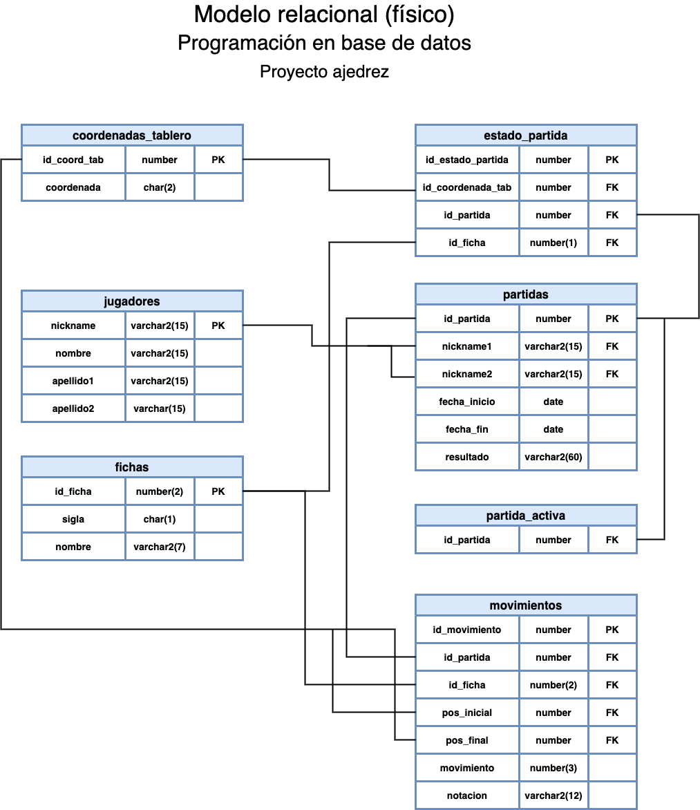

# Proyecto DBChess
## Juego de ajedrez en línea

## El ajedrez
El origen del ajedrez es incierto, así como su inventor, algunas leyendas apuntan su origen en la india, junto con la leyenda no menos famosa del valor factorial que al llegar a la casilla 64 su valor llega a 1.26 x 1089. Otras apuntan a los griegos en asedio a Troya en el año 1000 AC.

Pero sea cual fuere su origen e inventor, este ha venido evolucionando y aumentando sus adeptos, ya que es un juego de estrategia.

## Métodos aplicados
### Bloques PL/SQL anónimos

a)	**partida_activa**, bloque que indica si existe una partida activa, mostrando el número de partida.

b)	**ini**, bloque que establece como activa una partida, se necesitan los nicknames de ambos jugadores y el identificador de la partida para poder ejecutarlo.

c)	**mov**, bloque con el cual se pueden realizar movimientos de las fichas en el tablero, se ingresa la coordenada de origen, es decir la coordenada del tablero donde se ubica la ficha que se quiere mover, posteriormente se ingresa la coordenada de destino de la ficha.

d)	**viewTablero**, bloque con el cual se puede visualizar el tablero de la partida que se encuentra activa.

e)	**insertJugadores**, bloque con el que se pueden insertar nuevos jugadores.

f)	**insertPartidas**, bloque para poder insertar partidas nuevas.

### Datos almacenados
En el siguiente apartado se detallan los procedimientos, funciones y trigger almacenados en la base de datos del juego, estas son:

#### Procedimientos

a)	**p_empate**, este procedimiento permite al jugador solicitar al oponente un empate.

b)	**p_empate_respuesta**, procedimiento que agrega en la tabla partida en la columna resultado la leyenda de empate y en la columna anotación coloca el texto "=”.

c)	**e_enroque_c**, permite realizar un enroque corto.

d)	**p_enroque_l**, procedimiento permite realizar un enroque largo.

e)	**p_hist_partidas**, permite visualizar el historial de partidas de un jugador, se necesita ingresar el nickname del jugador.

f)	**p_mate**, este procedimiento finaliza la partida mediante la aceptación de un jaque mate.

g)	**p_mov**, procedimiento imprime los movimientos de la partida activa.

h)	**p_mov_his**, permite observar los movimientos realizados en una partida, mediante el identificador de la partida.

#### Funciones

a)	 **f_coord**, esta función recibe como parámetro la coordenada del tablero y retorna el id_cord_tab de la tabla coordenadas_tablero.

b)	**f_existe_nickname**, función que recibe como parámetro un nikcname y retorna “true” si este existe en la tabla jugadores o “false” en el caso contrario.

c)	**f_full_name**, recibe como parámetro un 1 o 2, dependiendo de si lo que se requiere obtener es el nombre completo del jugador 1 o 2.

d)	**f_full_name_otro**, recibe como parámetro el nickname de un jugador y esta retorna el nombre completo del jugador, en caso de que este exista.

e)	**f_id_ficha**, recibe como parámetro la coordenada del tablero y retorna el id_ficha de la tabla coordenadas_tablero.

f)	**f_jaque**, esta función retorna 1 si la partida está en jaque, sino lo está retorna 0, en caso de que la partida no esté activa retorna un -1, además recibe como parámetro la coordenada del tablero.

g)	**f_mueve**, esta función sirve para determinar el color de la ficha que le toca realizar un movimiento.

h)	**f_n_mov**, esta función retorna la cantidad de movimientos que lleva la partida.

i)	**f_nombre_ficha**, esta función recibe como parámetro el id_ficha y retorna el nombre de esta. Si el id_ficha no es correcto, retorna un -1 o -2.

j)	**f_partida_activa**, esta función retorna el id de la partida que se encuentra activa.

k)	**f_rey**, la función retorna la coordenada en la que se encuentra ubicado el rey del jugador vigente.

l)	**f_sigla**, recibe como parámetro el id_ficha y retorna la sigla de esta.

m)	**f_validar**, esta función recibe los parámetros, la coordenada de origen, la coordenada de destino, el id_ficha y cuál es el color de las fichas que mueven. Esta función valida movimientos válidos de las fichas.

n)	**f_alfil_val**, **f_caballo_val**, **f_dama_val**, **f_peon_val**, **f_rey_val** y **f_torre_val**, todas estas funciones reciben la coordenada inicial, la coordenada de destino y el color de la ficha que mueve en ese momento y validan que los movimientos sean válidos de acuerdo con cada movimiento particular de cada ficha.

#### Triggers

a)	**t_ini_estado_partida**, este trigger inicializa el tablero al crearse la partida.

b)	**t_mov**, este trigger actualiza el estado de la partida en el tablero.

c)	**t_partida_activa**, actualiza el estado de la partida en el tablero.

### Modelo físico

`

### Modelo relacional

.png)